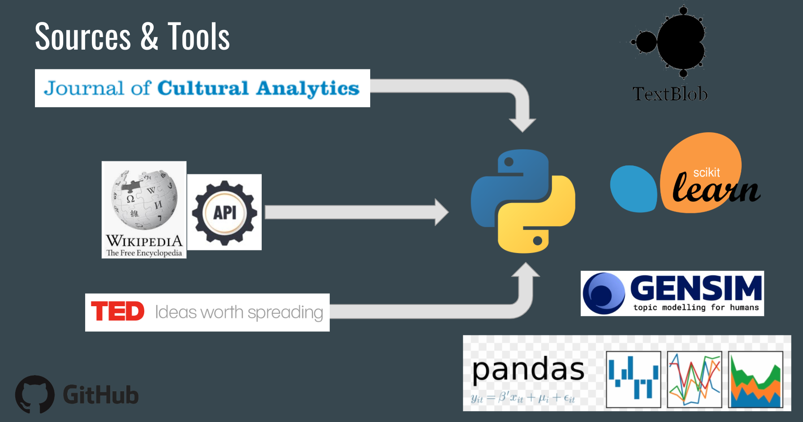
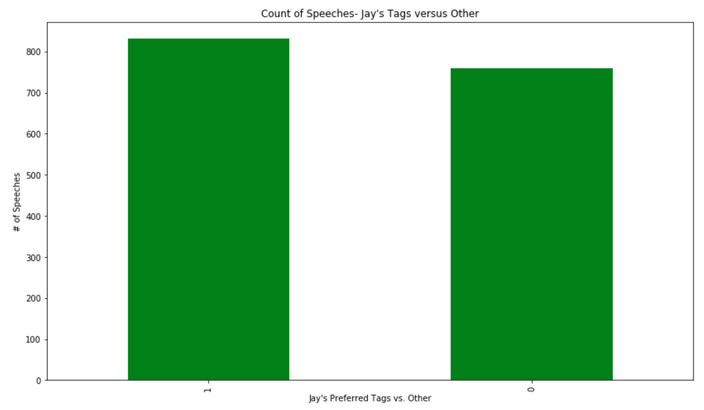
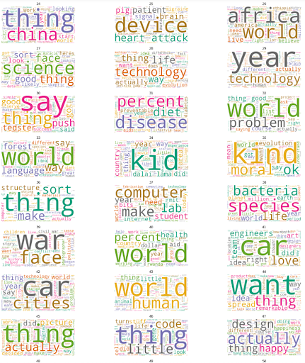
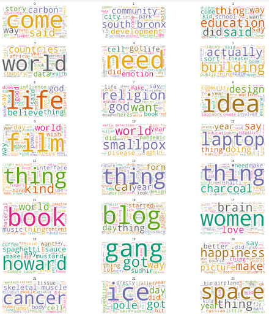
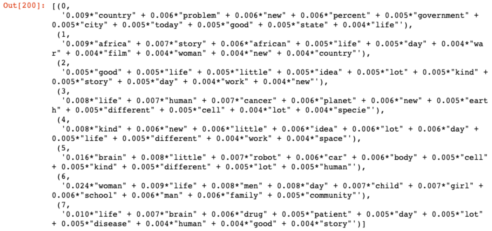
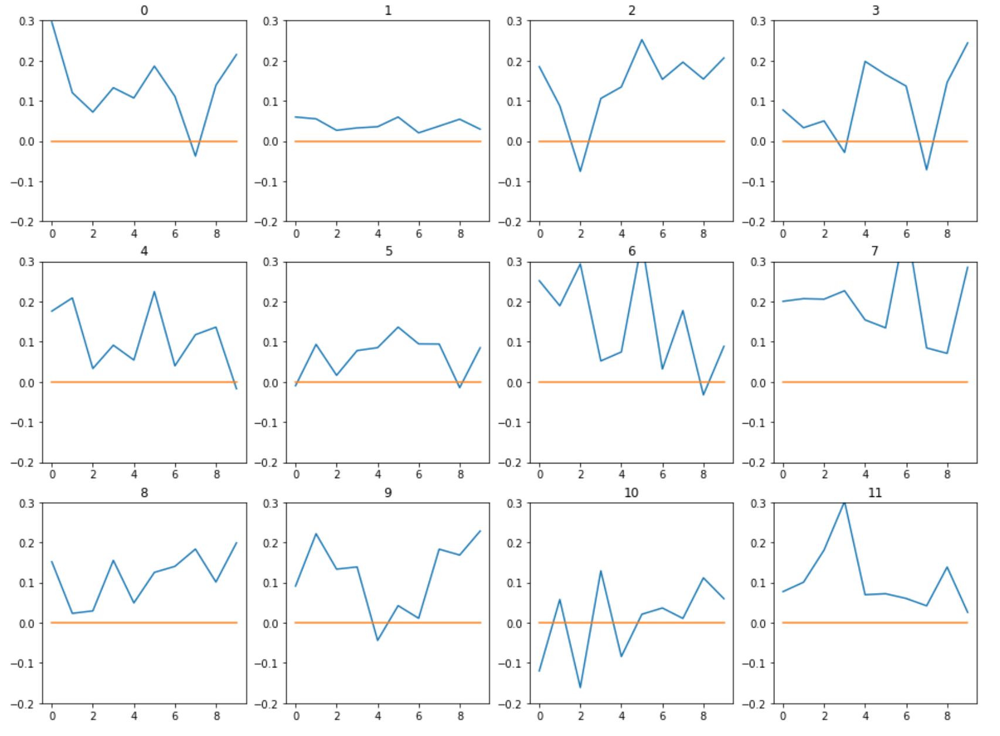
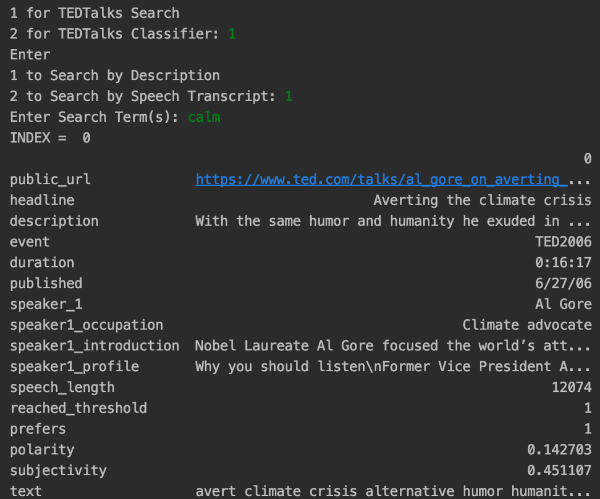

# The Language of TEDTalks: An Exploration of Natural Language Processing
Jay Kim

## Motivation: Why TEDTalks Data?
Full of Personal Favorites
* Particularly "humanity-related" topics
* Fertile ground for context, semantic analyses
Relatively recent, and very interesting dataset- both in terms of linguistics and topics
* Part of ongoing study- potential to perhaps contribute (at least with cleaning and transcribing)?

## Data Sources & Data Science Tools
__Sources__
* Journal of Cultural Analytics: A study by Katherine M. Kinnaird & John Laudun(published July 2019)-- 1,756 total speeches --> trimmed to 1,591 after pre-processing
* TEDTalks website: links to videos
* Wikipedia (shelved for now, to develop further)

## Explanatory Data Analysis
__Tried Multiple Approaches to NLP Pre-processing__
* Contractions, Accents
* Stemming/Lemmatizing
* Stop Words
* Tokenization
* Bag of Words
__Regular Expressions__

__Tried Categorizing/Classifying by Total Views__

* _Concluded that this is not the most helpful variable_

## NLP Data Exploration is Valuable and Necessary- But What's My End-Goal?
__Decided on creating two components that user can interact with:__
1) Classification (using Naive Bayes): Classified as part of Jay's Favorite Tags (831 speeches), or Not (760 speeeches)?
* _Jay's Favorite Tags are: Humanity, Commumnity, Activisim, Society, Social Good, and Future_

2) Cosine Similarity between Query and Speeches (using Gensim): Returns most similar speech, opens and plays video (using Selenium)

## Topic Modeling
* Used LDA, NMF, and wordcloud visuals- Patterns starting to emerge

## Sentiment Analysis
* Segmented each speech into 10-piece clusters of text
* Included in Simlarity Component: Speech most similar to query prompts pop-up window (like below)

## Classification (Naive Bayes)
Ran on various combinations of text categories:
* Sub-par precision score
* Started experimenting with SVM (cut short)

## Document Similarity
* User has choice between search speech transcripts (slower) or description (faster)
* Outs a transposed dataframe

## Conclusions and Further Improvements
__Discovered some patterns, and completed (two) "deliverables, but much room for improvement__
- ways to speed up code (other modules?  use of shards?)
- Transcript scroller + link to wikipedia profiles
- Will continue to be "fertile ground" for learning & appyling NLP concepts
